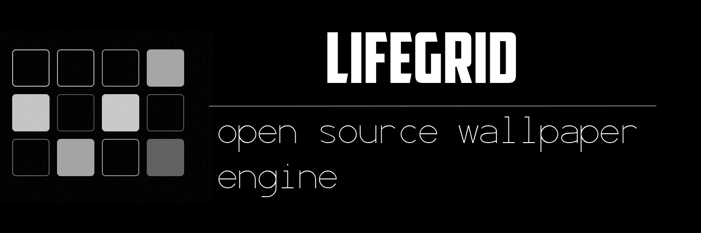

# JIKAN

> **Premium Dynamic Wallpapers for iOS and Android Lock Screens.**
>
> 极简美学，数据驱动。为您的手机锁屏打造的高精度动态壁纸。

<p align="center">
  <a href="#english">English</a> | <a href="#chinese">中文</a>
</p>

---

<div id="english"></div>

## 🌟 Introduction

JIKAN generates high-resolution, data-driven wallpapers that help you visualize your time, goals, and life progress directly on your iPhone or Android lock screen. 

## ✨ Features

- **Dynamic Visuals**
  - **Year Progress**: 365 dots representing every day of the year.
  - **Life Calendar**: Every week of your life in a single grid.
  - **Goal Countdown**: Circular progress tracker for your biggest targets.

- **Pixel-Perfect**
  - Native resolution generation for modern iPhones.
  - Smart layout adjustments for Notch vs Dynamic Island devices.
  - Consistent rendering between Canvas (Preview) and SVG (Export).

- **Architecture**
  - **Privacy First**: No database, no tracking. State encoded in URL.
  - **Modern Stack**: React 19, Vite, Tailwind v4.
  - **Serverless**: Cloudflare Workers with Rust-based SVG rendering.

## 🛠 Tech Stack


## 🚀 Getting Started

### Prerequisites
- Node.js & npm
- Cloudflare Wrangler CLI (`npm install -g wrangler`)

### Development

```bash
# Install dependencies
npm install

# Start Frontend (Vite)
npm run dev

# Start Backend (Worker)
npx wrangler dev
```

### Deployment

```bash
# Build Frontend and Deploy Worker
npm run build
npx wrangler deploy
```

---

<div id="chinese"></div>

## 🌟 简介

JIKAN 生成高分辨率的数据驱动壁纸，帮助你在 iPhone 或 Android 锁屏上直接可视化你的时间、目标和人生进度。

## ✨ 特性

- **动态可视化**: 年度进度、人生日历、目标倒数。
- **像素级完美**: 针对现代 iPhone 的原生分辨率生成，前后端渲染逻辑严格一致。
- **隐私至上**: 无数据库，无追踪。

## 🛠 技术栈

React 19, Vite, Tailwind CSS v4, Cloudflare Workers, Rust (Resvg).

## 🚀 快速开始

### 开发

```bash
# 安装依赖
npm install

# 启动前端
npm run dev

# 启动后端
npx wrangler dev
```

### 部署

```bash
# 构建并部署
npm run build
npx wrangler deploy
```

---

## ❤️ Credits & Acknowledgements

This project stands on the shoulders of giants.
Special thanks to the original open-source contributor:

**[aradhyacp](https://github.com/aradhyacp)** - *For the original concept and codebase inspiration.*

Made with ❤️ for mindful living.
Copyright © 2026 daftAI.
